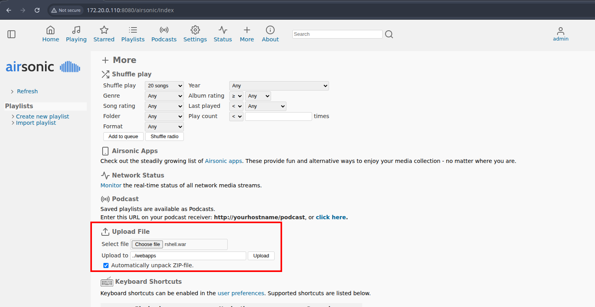
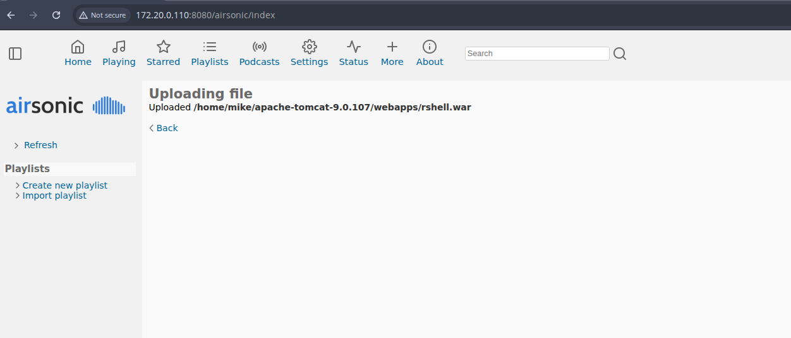
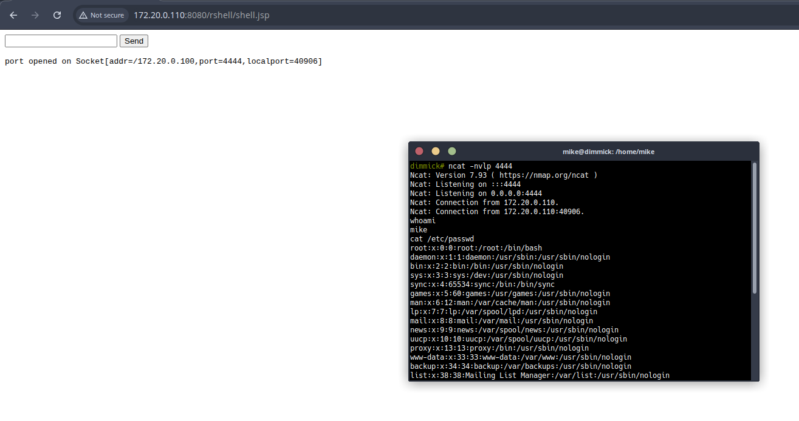

# Unrestricted File Upload and Path Traversal to Remote Code Execution in Airsonic Advanced

**Severity:** Medium  
**Vectors:** CWE-434 Unrestricted Upload of File with Dangerous Type; CWE-22 Path Traversal  
**CVSS v3.1:** `AV:N/AC:L/PR:L/UI:N/S:U/C:L/I:L/A:L/E:P/RL:X/RC:R` (6.3)  
**Tested build:** Airsonic Advanced `10.6.0` on `Linux`, under Apache Tomcat `9.0.107`  
**Reporter:** `Mike Cole, Mantel Group`  
**CVE:** `CVE-2025-10669`  
**Disclosure status:** `Public (full disclosure)`  

---

## Summary

Airsonic Advanced allows an authenticated user to exploit the 'Upload playlist' feature to write attacker-controlled files outside the intended storage directory by abusing the 'Upload to' input. By supplying a path traversal value such as `../webapps`, an attacker can upload a `.war` file into Tomcat's `webapps` directory. Tomcat will auto-deploy the archive, which yields arbitrary code execution under the application server account. This results in full compromise of the application and potentially the host.

This issue combines insufficient server-side validation of the target path with a lack of file type restrictions for the playlist upload. When Tomcat auto-deploy is enabled, the impact escalates to RCE.

---

## Affected components

- Web UI: 'Upload playlist' function  
- Server: File handling for uploaded playlists and path resolution  
- Application server: Tomcat auto-deployment behaviour for `.war` files

---

## Impact

An authenticated user can achieve remote code execution on the server that hosts Airsonic Advanced. Successful exploitation permits:

- Execution of arbitrary code with the privileges of the application server user  
- Access to application secrets and media libraries  
- Lateral movement within the environment depending on host hardening  
- Defacement or service disruption

---

## Preconditions

- Attacker has a valid user account, or the upload endpoint is otherwise reachable with low privileges  
- Tomcat is configured to auto-deploy applications placed in `webapps` (default in many installs)  
- No reverse proxy or server-side validation prevents traversal sequences like `../`

---

## Technical details

- The 'Upload playlist' feature accepts a user-supplied destination path via the 'Upload to' field.  
- The server does not canonicalise and constrain this path to an allowed base directory.  
- The server accepts uploads with dangerous types, including `.war`.  
- When the destination resolves to Tomcat's `webapps`, the server writes the uploaded `.war` adjacent to deployed applications.  
- Tomcat detects the new archive and deploys it, enabling attacker-controlled code execution.

---

## Proof of exploitability

High-level reproduction outline (use a benign file to validate):

1. Authenticate as a standard user.  
2. Navigate to 'Upload playlist'.  
3. Set 'Upload to' to a parent directory traversal that resolves to Tomcat's deployment directory (for example, a value that resolves to `../webapps`).  
4. Upload an application archive with a harmless JSP that prints a timestamp to confirm execution.  
5. Browse to the deployed context path and observe server-side execution.

*Note:* Do not publish shell payloads or sensitive server responses. Use a benign file to validate.

---

## Evidence

The 'Upload to' value resolves outside the intended path.

Server accepts and stores the uploaded archive in the resolved location.

Accessing the new context demonstrates code execution.

---

## Security analysis

- **Root cause:** Missing canonicalisation and enforcement of an allowed upload root, combined with insufficient file type and location controls.  
- **Why it is severe:** The flaw bridges a content upload into an executable deployment path. With Tomcat defaults, `.war` files are executed automatically, converting a file write into RCE.  
- **Related weaknesses:** CWE-434, CWE-22, and insecure defaults around auto-deploy.

---

## Remediation

**Short term mitigations:**

- Block traversal patterns server-side. Reject any path containing `..`, mixed encodings, symlinks, or absolute paths. Canonicalise and enforce that the resolved path is a child of an approved base directory.  
- Enforce an allow-list of upload destinations. Replace free-text directories with server-defined options.  
- Restrict file types and MIME types for playlist uploads to non-executable formats only. Reject archives and server-executable types.  
- Disable Tomcat `autoDeploy` and `deployOnStartup` if not strictly required, or ensure user-writable locations cannot map to deployment directories.  
- Ensure the Airsonic process user does not have write permissions to Tomcat's `webapps` directory. Separate data directories from application directories.

**Long term fixes:**

- Refactor the upload code to ignore client-supplied target paths. The server should determine storage paths.  
- Perform strict server-side validation, canonicalisation, and normalisation before any file I/O.  
- Store user content outside application and runtime directories.  
- Add tests that verify uploads cannot escape the intended directory and that dangerous types are rejected.

---

## Detection and forensics

- Review Tomcat logs for recent deployments and context creation events.  
- Inspect the `webapps` directory for unexpected archives or directories.  
- Check Airsonic logs around upload endpoints for unusual 'Upload to' values or traversal markers.  
- Look for outbound connections spawned by the application server user.  
- Validate integrity of application files and dependencies against known-good hashes.

---

## Timeline

- `<2025-08-05>` Initial discovery  
- `<2025-08-06>` Attempted to contact vendor on GitHub and IRC
- `<2025-09-06>` Public disclosure
- `<2025-09-18>` CVE-2025-10669

---

## Credits

- Discovered by `Mike Cole, Mantel Group`

---

## References

- CWE-434: Unrestricted Upload of File with Dangerous Type  
- CWE-22: Path Traversal  
- Apache Tomcat documentation on deployment and `autoDeploy` settings

---

## Appendix A: Responsible disclosure notes

This write-up omits weaponised payloads and exact file contents. Reproduction should be performed in a controlled environment using benign artefacts. Publicly sharing exploit code that enables immediate compromise is discouraged until users have had reasonable time to patch.

---
