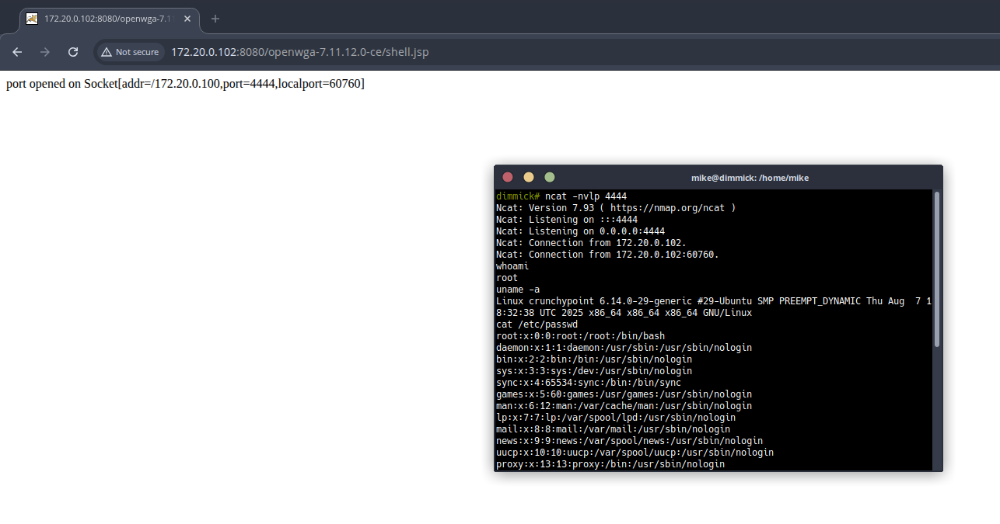

# Remote Code Execution via TMLScript File Write in OpenWGA Admin Client

**Severity:** High  
**Vectors:** CWE-94 Improper Control of Generation of Code; CWE-434 Unrestricted Upload/Write of File with Dangerous Type; CWE-73 External Control of File Name or Path  
**CVSS v3.1:** `AV:N/AC:L/PR:H/UI:N/S:U/C:H/I:H/A:H/E:P/RL:X/RC:R` (7.1)  
**Tested build:** OpenWGA Admin Client `7.11.12 (Build 737)` on `Linux`, under Apache Tomcat `9.0.107`
**Reporter:** `Mike Cole, Mantel Group`  
**CVE:** `TBD`  
**Disclosure status:** `Private (responsible disclosure in progress)`  

---

## Summary

OpenWGA Admin Client exposes TMLScript APIs that allow file I/O via `WGA.File`. In the tested build, a user with Admin or Design rights can write attacker-controlled files into a web-served path. Writing a server-interpreted artefact (for example a `.jsp`) into the OpenWGA webroot and then requesting it over HTTP results in remote code execution under the application server account.

This combines insufficient restriction of TMLScript file writes with a webroot that is writable and executed by the servlet container.

---

## Affected components

- Admin Client: TMLScript execution context  
- TMLScript API: `WGA.File` file creation and write operations  
- Servlet container: execution of server-side artefacts placed under the application webroot

---

## Impact

An authenticated high-privilege user can achieve remote code execution on the server hosting OpenWGA. Successful exploitation allows:

- Execution of arbitrary commands as the application server user  
- Access to application data and configuration  
- Potential lateral movement depending on host hardening and network position  
- Defacement or service disruption

---

## Preconditions

- Authenticated access to the Admin Client with permission to execute TMLScript (Admin/Design)  
- The OpenWGA process has write access to a directory that is served by the container (for example the webroot)  
- Network access to request the newly written file over HTTP(S)

---

## Technical details

- TMLScript provides `WGA.File` for file creation and writes.  
- When invoked from the Admin Client, it is possible to specify paths that resolve inside the application’s web-served directories.  
- Writing a server-side artefact such as `.jsp` places executable content under the servlet container’s document base.  
- A subsequent HTTP request to that path triggers server-side execution in the context of the application server user.

---

## Proof of exploitability

High-level reproduction outline (use benign artefacts first):

1. Authenticate to the Admin Client with a role that can execute TMLScript.  
2. Use `WGA.File` to create a test file (for example `poc.txt`) under a web-served directory and verify `GET /poc.txt` returns a known marker.
```
var f = WGA.File(new java.io.File("../webapps/openwga-7.11.12.0-ce/poc.txt"));

f.write("poc file write into webroot");

return "OK";
```

---

## Evidence




---

## Security analysis

- **Root cause:** Insufficient restriction and policy around TMLScript file writes that can target web-served locations.  
- **Why it is severe:** A file write primitive to the webroot, combined with server-side interpretation, becomes direct RCE.  
- **Related weaknesses:** CWE-94, CWE-434, CWE-73. Environments that allow the application user to modify the document base increase risk.

---

## Remediation

**Short term mitigations:**

- Constrain `WGA.File` so writes are limited to a non-served data directory; canonicalise and enforce that resolved paths remain under an approved base.  
- Deny dangerous extensions by default (for example `.jsp`, `.jspx`, `.gsp`) and use an allow-list for permitted types.  
- Run with a read-only webroot in production (immutable image or read-only bind mount).  
- Ensure the OpenWGA process user lacks write permission to any executed paths.

**Long term fixes:**

- Introduce a TMLScript sandbox or explicit I/O policy that rejects absolute paths, traversal, and webroot targets.  
- Separate application and content directories with strict permissions; add tests to prevent writes to executed locations.

---

## Detection and forensics

- Monitor Admin Client and application logs for `WGA.File` activity targeting served directories.  
- Diff the webroot for new or modified files, especially server-interpreted extensions.  
- Review HTTP access logs for first-seen requests to unusual dynamic paths shortly after file writes.

---

## Timeline

- `<2025-09-11>` Initial discovery on `7.11.12 (Build 737)`  
- `<2025-09-12>` Vendor notified, no response
- `<TBD>` Public advisory

---

## Credits

- Discovered by `Mike Cole, Mantel Group`

---

## References

- OpenWGA documentation: TMLScript and `WGA.File` API  
- Servlet container documentation on executing server-side artefacts and securing the webroot  
- CWE-94, CWE-434, CWE-73

---

## Appendix A: Responsible disclosure notes

This write-up omits weaponised payloads and exact file contents. Reproduction should be performed in a controlled environment using benign artefacts. Publicly sharing exploit code that enables immediate compromise is discouraged until users have had reasonable time to patch.

---
