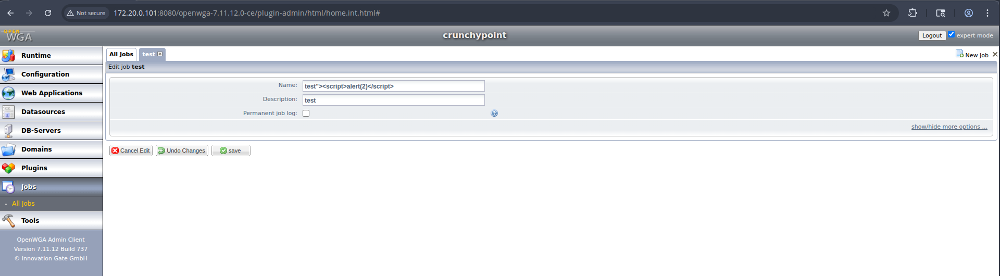
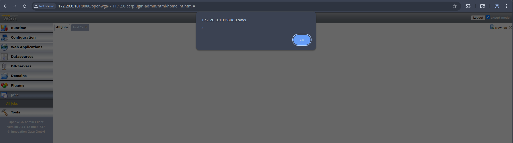
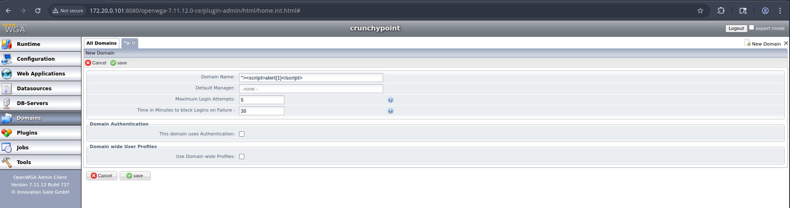
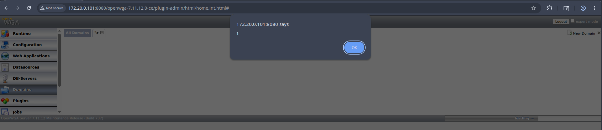

# Multiple Stored Cross-Site Scripting in OpenWGA Admin Client

**Severity:** High  
**Vectors:** CWE-79 Improper Neutralization of Input During Web Page Generation (Cross-site Scripting); CWE-116 Improper Encoding or Escaping of Output  
**CVSS v3.1:** `AV:N/AC:L/PR:L/UI:R/S:C/C:L/I:L/A:N/E:P/RL:X/RC:R` (6.4)  
**Tested build:** OpenWGA Admin Client `7.11.12 (Build 737)` on `Linux`, under Apache Tomcat `9.0.107`  
**Reporter:** `Mike Cole, Mantel Group`  
**CVE:** `TBD`  
**Disclosure status:** `Private (responsible disclosure in progress)`  

---

## Summary

The OpenWGA Admin Client persists untrusted input in multiple administrator-facing fields without consistent, context-safe output encoding. When these values are later rendered in the Admin UI, stored JavaScript executes in the victim's browser. Impacted views include pages where saved names, titles, descriptions or other metadata are listed or previewed. This allows an attacker with low privileges to run arbitrary script in the context of a higher-privileged user's session.

---

## Affected components

- Admin Client forms that accept and later render saved text fields
- List and detail views that display stored names, titles, labels and descriptions
- Any UI element that injects stored values into HTML, attributes, URLs or script contexts without encoding

---

## Impact

Stored XSS leads to arbitrary script execution in the victim's browser and enables:

- Session theft or account takeover of administrators viewing affected pages  
- CSRF via same-origin privileges  
- UI redress and data exfiltration from the Admin Client  
- Potential server compromise if chained with Admin features or known gadget endpoints

---

## Preconditions

- Attacker can authenticate with low privileges or influence content that is later shown to higher-privileged users  
- A higher-privileged user visits an affected Admin Client page that renders the stored value

---

## Technical details

- User-controlled values are saved and later inserted into the DOM with insufficient context-specific encoding  
- In affected views, values appear to be written using raw innerHTML or template bindings without HTML, attribute or URL encoding  
- Because the same stored values are reused across different contexts, a payload that is safe in one context may execute in another (for example, attribute vs text)

---

## Proof of exploitability

Reproduce using a benign payload first:

1. Authenticate as a low-privileged user and navigate to an Admin Client form that stores a label or description  
2. Save a field with a harmless probe such as:  
   - `">`  
   - `<svg onload=confirm(1)>`  
3. Log in as an administrator and open a page that lists or previews the stored value  
4. Observe client-side code execution when the page renders the stored content

*Note:* Use non-destructive payloads during verification. Full list of affected fields and views is available to the vendor.

---

## Evidence

Stored XSS vulnerabilities exist in most fields in the admin application. Creating jobs for example.

Viewing jobs executes the stored JavaScript.

Creating domains is also vulnerable.

Viewing domains executes the stored JavaScript

---

## Security analysis

- **Root cause:** Lack of consistent, context-aware output encoding for stored user-controlled values  
- **Why it is severe:** The vulnerability persists until the value is edited or removed, and it triggers on every view by privileged users  
- **Related weaknesses:** CWE-79 and CWE-116. Risk is higher where the same value is reused across multiple contexts

---

## Remediation

**Short term mitigations:**

- Apply context-specific encoding at every render point  
  - HTML text nodes: encode with `&lt;`, `&gt;`, `&amp;`, `&quot;`  
  - HTML attributes: encode quotes and special characters, never concatenate untrusted strings into event handlers  
  - URLs: percent-encode untrusted parts, never place untrusted input directly in `javascript:` URLs  
- Strip or sanitise dangerous markup when rich text is required (for example OWASP Java HTML Sanitizer)  
- Deploy a strict Content Security Policy to reduce exploitability, including blocking inline script where feasible

**Long term fixes:**

- Centralise encoding in templating helpers using a safe encoding library (for example OWASP Java Encoder)  
- Ensure templates and components default to escaped output with explicit opt-in for safe HTML  
- Add server-side validation to reject input that contains executable markup in fields that should be plain text  
- Add unit and integration tests that cover rendering in HTML, attribute and URL contexts

---

## Detection and forensics

- Review application logs and change history for suspicious label or description values containing `<`, `>` or event handler patterns such as `onerror=`  
- Enable CSP reporting and monitor violation reports for inline script execution on Admin pages  
- Inspect browser developer tools during reproduction to capture the executing element and call stack

---

## Timeline

- `<2025-09-11>` Initial discovery on `7.11.12 (Build 737)`  
- `<2025-09-12>` Vendor notified, no response
- `<TBD>` Public advisory

---

## Credits

- Discovered by `Mike Cole, Mantel Group`

---

## References

- OWASP Cross-Site Scripting (XSS) Prevention Cheat Sheet  
- OWASP Java Encoder Project  
- OWASP Java HTML Sanitizer

---

## Appendix A: Responsible disclosure notes

This write-up omits exploit chains and payloads that target specific admin workflows. Reproduction should be done in a controlled environment with benign probes. Public disclosure should follow coordinated timelines to allow users to patch.
